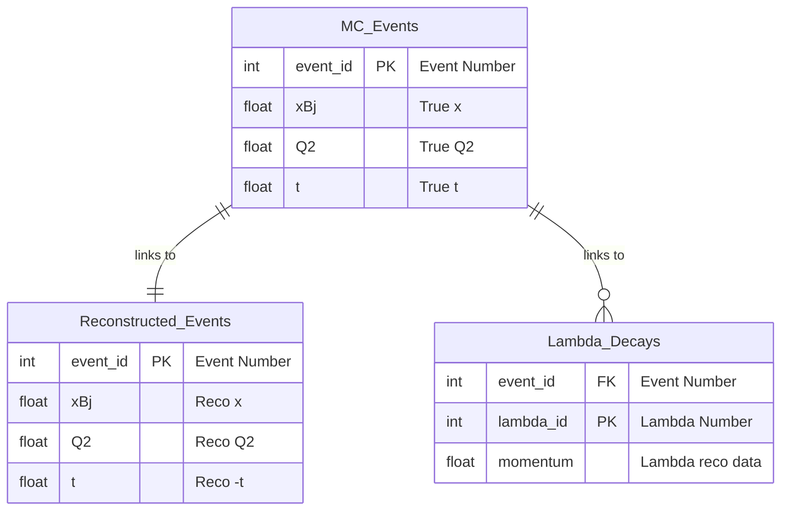
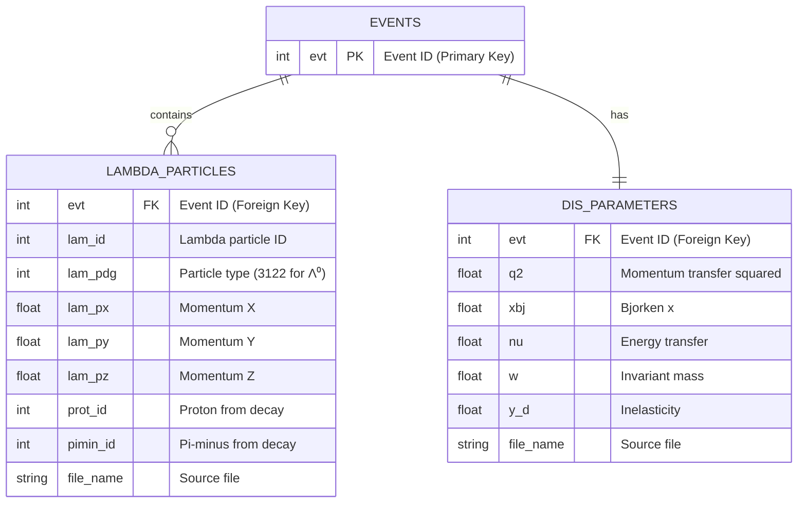

# Python processing CSV

Tutorials on processing CSV using common python data science tools


## CSV for analysis

The CSV (Comma-Separated Values) format is exceptionally convenient for data processing. 
It is simple, yet processed efficiently, supported by many analysis and introspection tools, 
and is human-readable even without them. 
However, CSV expects a fixed number of columns while our data is often presented hierarchically, 
resembling a tree: events contain particles, which have hypotheses corresponding to tracks, 
which in turn are composed of clusters composed of hits. 

Consequently, we cannot directly convert our EDM4EIC ROOT files to CSV. 
Instead, we first process, refine and flatten this hierarchical data structure 
to get something more simple and more table-wise. And work pleasantly.

## Introduction: From CSV Files as a Database

For analyzing data, we can work with multiple CSV files that contain related information.
For example a CSV file containing MC level event information (xBj, Q2, -t), another table
containing reconstructed level information, and table representing lambda decay information linked
together by event numbers. 


These CSV files are essentially **database tables**, 
and understanding this relationship helps us organize and analyze data more effectively.

With python and pandas it is easy to organize them joined tables like 
`MCvsReconstructed events`

## Meson Structure data tables

### 2. MC DIS Parameters Table (`dis_parameters*.csv`)  
Contains Deep Inelastic Scattering parameters for each event:
- **One event has exactly one set of DIS parameters** (one-to-one relationship)
- Each row represents one complete event
- Includes kinematic variables: Q², x_Bjorken, energy, etc.


### 1. Lambda Particle Table (`mcpart_lambda*.csv`)
Contains detailed information about Lambda particles found in each event:
- **One event can have multiple Lambda particles** (one-to-many relationship)
- Each row represents one Lambda particle
- Includes particle properties: momentum, position, decay products, etc.


## Database Relationship Diagram



## Combine Multiple Files

The Key Challenge: Multiple Files = Broken Relationships

When we have multiple CSV files from different runs or datasets, each file starts its event numbering from 0:

```
File 1: evt = [0, 1, 2, 3, 4, ...]
File 2: evt = [0, 1, 2, 3, 4, ...]  ← ID Collision!
File 3: evt = [0, 1, 2, 3, 4, ...]  ← ID Collision!
```

**Problem**: Event 0 from File 1 is completely different from Event 0 from File 2, but they have the same ID!

**Solution**: Global Unique Event IDs

We need to create globally unique event IDs across all files:

```python
import pandas as pd
import glob

def concat_csvs_with_unique_events(files):
    """Load and concatenate CSV files with globally unique event IDs"""
    dfs = []
    offset = 0
    
    for file in files:
        df = pd.read_csv(file)
        df['evt'] = df['evt'] + offset  # Make IDs globally unique
        offset = df['evt'].max() + 1    # Set offset for next file
        dfs.append(df)
    
    return pd.concat(dfs, ignore_index=True)

# Load both tables with unique event IDs
lambda_df = concat_csvs_with_unique_events(sorted(glob.glob("mcpart_lambda*.csv")))
dis_df = concat_csvs_with_unique_events(sorted(glob.glob("dis_parameters*.csv")))
```

**Result**: Now we have globally unique event IDs:
```
File 1: evt = [0, 1, 2, 3, 4]
File 2: evt = [5, 6, 7, 8, 9]     ← No collision!  
File 3: evt = [10, 11, 12, 13, 14] ← No collision!
```

## Database Operations in Pandas

Now we can perform standard database operations:

### 1. Inner Join (SQL equivalent: `INNER JOIN`)
Get Lambda particles with their corresponding DIS parameters:

```python
# Join tables on event ID
joined = lambda_df.merge(dis_df, on='evt', how='inner')
print(f"Found {len(joined)} lambda particles with DIS data")
```

### 2. Filter and Join (SQL equivalent: `WHERE` + `JOIN`)
Find Lambda particles in high-Q² events:

```python
# High-Q² events
high_q2_events = dis_df[dis_df['q2'] > 50]

# Lambda particles in those events
high_q2_lambdas = lambda_df.merge(high_q2_events[['evt', 'q2']], on='evt')
print(f"Found {len(high_q2_lambdas)} lambdas in high-Q² events")
```

### 3. Aggregation (SQL equivalent: `GROUP BY`)
Count Lambda particles per event:

```python
lambdas_per_event = lambda_df.groupby('evt').size()
print(f"Average lambdas per event: {lambdas_per_event.mean():.2f}")
```

## Real-World Example: Physics Analysis

Let's analyze Lambda particle production in different kinematic regions:

```python
# Join lambda and DIS data
physics_data = lambda_df.merge(dis_df, on='evt', how='inner')

# Define kinematic regions
low_x = physics_data[physics_data['xbj'] < 0.1]
high_x = physics_data[physics_data['xbj'] > 0.3]

print("Lambda production rates:")
print(f"Low-x region (x < 0.1): {len(low_x)} lambdas in {low_x['evt'].nunique()} events")
print(f"High-x region (x > 0.3): {len(high_x)} lambdas in {high_x['evt'].nunique()} events")

# Calculate production rates
low_x_rate = len(low_x) / low_x['evt'].nunique()
high_x_rate = len(high_x) / high_x['evt'].nunique() 
print(f"Production rates: {low_x_rate:.3f} vs {high_x_rate:.3f} lambdas/event")
```

## Key Database Concepts Applied

| Database Concept | Our Implementation | Example |
|------------------|-------------------|---------|
| **Primary Key** | `evt` column | Unique identifier for each event |
| **Foreign Key** | `evt` in both tables | Links lambda particles to their events |
| **One-to-Many** | Event → Lambda particles | One event can have 0, 1, or many lambdas |
| **One-to-One** | Event → DIS parameters | Each event has exactly one set of DIS data |
| **JOIN** | `pandas.merge()` | Combine related data from both tables |
| **Index** | Setting `evt` as index | Fast lookups and joins |

## Best Practices

1. **Always ensure unique IDs** when combining multiple files
2. **Keep original file information** for traceability
3. **Validate relationships** after joining (check for missing data)
4. **Use appropriate join types**:
   - `inner`: Only events with both lambda and DIS data
   - `left`: All lambda particles, even if no DIS data
   - `outer`: All events from both tables

## Summary

Thinking of CSV files as database tables helps organize complex particle physics analyses:

- **CSV files** = Database tables
- **evt column** = Primary/Foreign key linking related data  
- **pandas operations** = SQL queries
- **Global unique IDs** = Solution for multi-file datasets

This approach scales well from small analyses to large datasets with millions of events across hundreds of files!